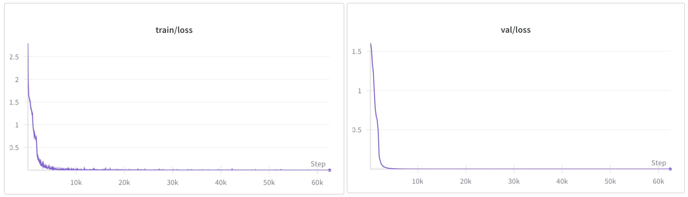

# Report

## Task setup
### k
I chose k=3 because 900x900=810,000 potential examples seems to be a reasonable dataset size. 

### Model
I use a basic causal lm from the Transformers library. 
- Embedding/hidden size d_model=128
- 4 layers
- 4 attention heads per layer (32-dim per head). 
- Feed-forward width uses the GPT-2 default 4*d_model, giving a 512-dim MLP. 
- Positional window n_positions=32 to more than cover the prompt plus answer tokens. 
- Input/output embeddings are tied.

### Tokenizer 
For this task we only need to tokenize digits, operands, and special tokens (bos, eos, pad) so we want to keep tokenization simple. This is why I choose to do character-level tokenization, this way I can keep the vocab small and avoid added complexity from more language suited tokenization strategies like BPE. 

## Data Design

LSD-first digit strings for all numbers (ones first). Prompt: "{rev(a)}+{rev(b)}=", target: rev(a+b) with natural length (3 or 4 digits). 
- Train/val pool: all pairs $(a,b)$ with $a\in[100,799]\cup[900,999]$ (excluding $a\in[800,899]$), $b\in[100,999]$; 720k unique pairs total. Shuffled once with a fixed seed, then sliced: 200k train, 20k val (no overlap). 
- Generalization splits (disjoint distributions):
  - `test_holdout_a`: $a\in[800,899]$, $b\in[100,999]$ (5k pairs, no replacement).
  - `test_4digit`: $a,b\in[1000,9999]$ (5k pairs, no replacement).
  - `test_leading_zero`: $a,b\in[0,99]$ rendered as 3-digit LSD-first (5k pairs, no replacement).
- Each example logs carries (from traditional addition algorithm): `num_carries` and `max_carry_chain_len`. 

## Training details
Trained as a next-token LM with the loss masked to answer tokens only.
- Batch size: 64
- learning rate: 1e-4
- linear schedule with warmup (200 steps)
- grad clipping (1.0)
- Epochs: 20 (training loss gets very low and an easy 30 mins on colab T4, was thinking to do 100 epochs which is what was done in Nanda et al. "Progress measures for grokking via mechanistic interpretability" but that would have taken too long.)

## Evaluation Suite
Test both exact match and fuzzy match (where we just look at if the first target_answer_len tokens match target answer to account for formatting errors) across all our evaluation datasets. I generate answers with greedy decoding (in this scenario where there is only one true answer, temperature based decoding doesn't make sense). 

## Results

| Split             | Exact match | Fuzzy match |
|-------------------|-------------|-------------|
| val               | 1.00        | 1.00        |
| test_holdout_a    | 1.00        | 1.00        |
| test_leading_zero | 0.00        | 1.00        |
| test_4digit       | 0.00        | 0.00        |

## Interpretation

The model has not learned a robust algorithm for addition, but there is evidence that the model has learned a correct mechanism for three digit addition. The model obtains 100% accurary on validation (in-distribution generalization) and 100% accuracy on our holdout set a (out of distribution). Additionally, when using fuzzy matching the model got 100% accuracy on leading zero two digit addition (this masks eos/length issues). Thus, the model shows some generalization across operand band (both are cases of unseen token in the largest significant digit).

The mechanism the model learned is certainly limited to 3 digit addition, even with fuzzy matching, the model fails to generalize to 4 digit addition. Manual inspection of the model predictions show only one and two digit answers (sequence lengths of 13 and 14), which makes sense as the model only ever has seen sequence lengths of 13 and 14 (including bos and eos tokens). Thus the model learns a strong signal to always predict eos at position 14, resulting in our truncated 4 digit outputs. The digits that the model is able to predict do not match the first digits of the target answer, if the model did in fact learn a mechanism to do addition, it fails on 4 digit input. 

Some evidence that makes me uncertain: It is understandable in the leading zero two digit addition case for the model to predict extra tokens for the two digit answer case because the model has never seen sequence lengths of 12, but if the model had learned a correct algorithm for three digit addition, then in the two digit cases where the correct answer is three digits, it should be able to correctly predict the eos token after the fact. The fact that the model never predicts the correct 3 digit answer indicates to me that it may have learned some series of correlations (biases to length) rather than the correct algorithm.

Note: When doing an example run with one epoch, validation accurary was already pretty high at around 80%, and training accuracy was around 90%. This could indicate that the task is easy to memorize / learn general heuristics in the 3 digit regime.

## Discussion

I chose to have the model use LSD-first digit strings because the intuitive algorithm that I know for addition involves computing the LSD digit first. Thus, I want the AR model to be able to directly do this computation. 

For evaluation, I originally planned to visualize error rates w.r.t num_carries and max_carry_chain_len but since results were so extreme (either 0% accuracy or 100% accuracy) there are no distributions of error to investigate.

Hold out test could be selected better, the model only really needs to learn the relations for the first 3 digits and for 4 digit answers the last digit is always 1. Stronger holds to probe algorithm learning would be to exclude specific ones/tens digits or carry-heavy buckets (e.g., all examples with 2+ carries), so the model must generalize the addition mechanism rather than memorizing seen patterns.